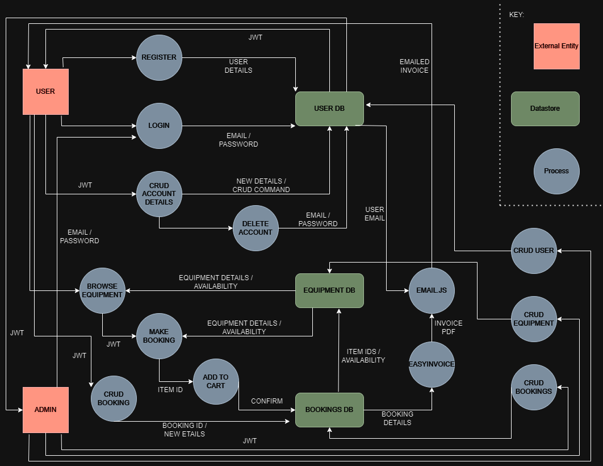
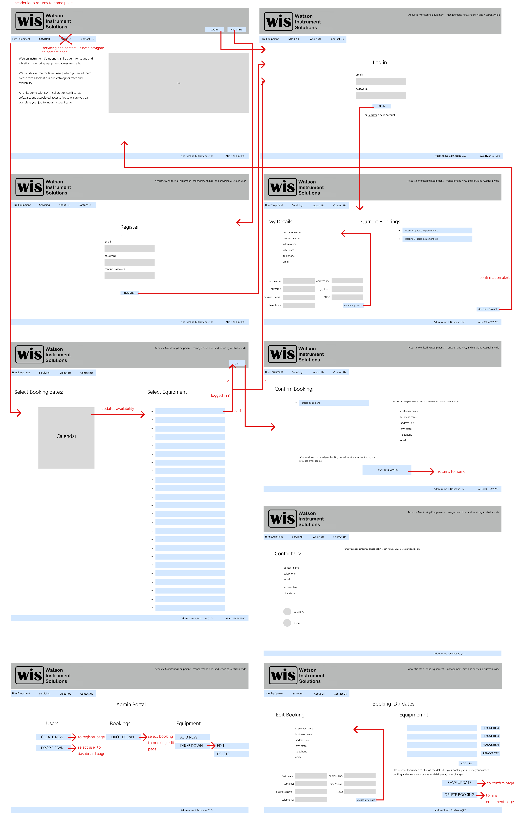
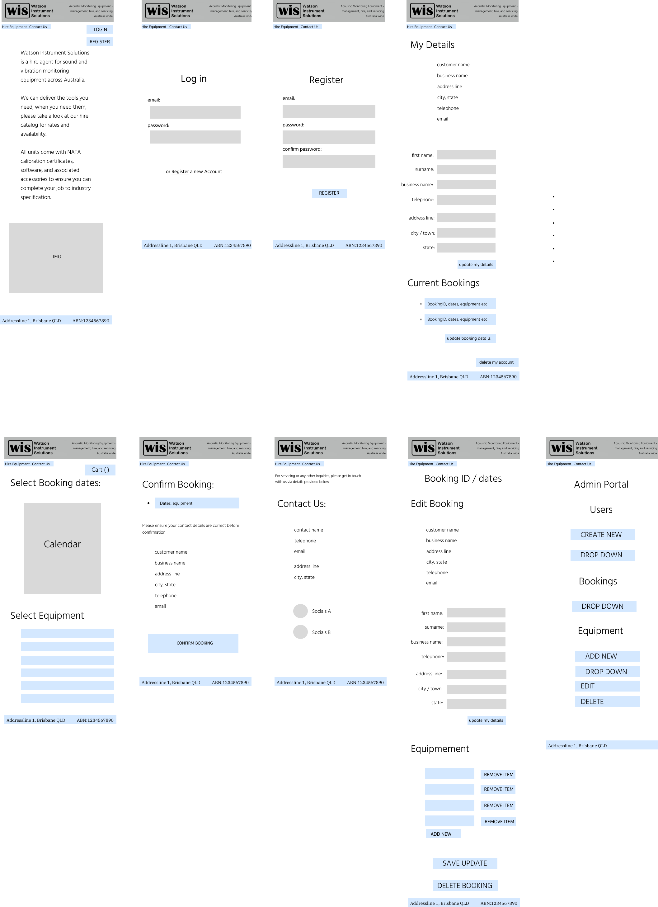

# Watson Instrument Solutions - Documentation

### Trello board : https://trello.com/b/HYZPSzNc/wissite

---


## Purpose

The aim of this site is deliver a professional web portal for the current customer base of WIS. Currently, they take hire bookings via email and phone call only so having an online booking system will save their customers time, and enable them more efficient project planning by being able to see equipment availability immediately without having to wait for a returned email or phone call.

Additionally, the site will enable them to grow their customer base by having another avenue for potential customers to find them and using tools like google ads / key words. 


## Functionality & Features

### Customer Users

#### Customer Account Creation

Customers can create a user account by providing a username, email and password.

#### Customer Log in

Customers can then log in using their email and password for verification and start making hire bookings.

#### Account / Profile page

Once logged in customers will be able to see and edit their current user information such as email, password, contact phone number, address as well as view any current bookings.

#### Log out

Customers will be able to logout of their account so their data is secure.

### Admin Users

#### Admin Creation

Admin accounts will be able to create other admin, and non admin accounts, the business owners frequently hire their own equipment to themselves for another side of their business, so being able to create their own bookings is a requirement. 

#### CRUD all bookings / users

Admin accounts will be able to view and edit / delete all current bookings from all users. They will also be able to view create/update/delete all users if necessary.

#### CRUD all equipment

Admin accounts will have full control over all equipment and it pricing listed on the site.

### Browsing

Anyone will be able to browse equipment, each item will have an image and description as well as a dynamic calendar to show its availability. This way any potential new customers will be able to quickly see if the equipment they need is available without going through a sign up process.

### Booking System

Customer users will be able to create a booking, then prompted to give the dates, and then the equipment they need (multiple items). They will be shown an alert if one of the pieces is unavailable. Then shown a confirmation page with all details. If they confirm they will have an invoice auto generated and sent to their user email address.

If once a booking is created, it needs to be updated or deleted they will need to contact one of the business owners directly via details provided on the contact page. This is subject to change depending on the business cancellation policy.

## Target Audience

The target audience for WIS are professional acoustician businesses only. It is very unlikely for anyone outside of the industry to need to hire this kind of equipment without at least using a subcontractor who has the expertise to use it. Therefore it is assumed that most users will be technical and already have a strong grasp of the products they need to hire, so the focus will be be on providing efficient, clear ease of navigation to save time and provide an easy transactional experience. 

## Tech Stack

### Front-end:

- REACT
- Bootstrap

### Back-end:

- Express
- Node.js
- MongoDB
- Email.js
- easyinvoice (npm package)

### Design:

- Figma
- draw.io

### Deployment:

- Netlify
- Mongo Could Atlas
- Heroku

## Data Flow Diagram



### Rough JSON Models

```js 
User {
    "id": Number, unique, required = true,
    "first name": String, required = true,
    "last name": String, required = true,
    "business name": String, required = true,
    "telephone": Number, required = true,
    "email": String, required = true,
    "password": hash, required = true,
    "address line": String, required = true,
    "city/town": String, required = true
    "postcode": Number, required = true
}

Booking {
    "id": Number, unique, required = true,
    "equipment id": Number, unique, required = true,
    "user id": Number, unique, required = true,
    "start date": Date, required = true,
    "end date": Date, required = true
}

Equipment {
    "id": Number, unique, required = true,
    "item name": String, unique, required = true,
    "description": String,
    "price per day": Number, required = true,
    "price per week": Number, required = true,
    "price per month": Number, required = true,
    "supply cost": Number
}
```

## Application Architecture Diagram


## User Stories

### 1 - Richard Whitely (Customer User)

Richard (39) is a certified acoustician operating as a sole trader in Brisbane. He works via contract drafting acoustic reports for new or upgrading buildings. To gather data for his reports he needs to use specialised acoustic monitoring equipment and chooses to hire it on a per contract basis as its more cost effective. 

Richard has a strong technical knowledge base and frequently used WIS for hiring as he is familiar with their catalog and they are local to him. He has developed a good working and personal relationship with the owners, however he occasionally hires from other companies when the specific tools he requires are not available for the dates he needs them.

### 2 - Annika Rice (Customer User)

Annika (42) works for a larger Acoustics company with offices in Melbourne, Adelaide, and Sydney. Her company commonly takes large contracts to provide acoustic reports to government buildings, airports, and new large buildings of many types. Often her companies own resources are stretched beyond their capacity so they will use WIS to supplement them so they can fulfill more concurrent projects across different states. 

Annika does not have first hand experience of using the equipment that she books but is familiar enough to be able to identify them by model names/numbers. Annika has a good professional relationship with the owners but expects a fast turnaround on her queries and requests.

### - Carol Vordemon (Customer User)

Carol (59) runs a mid size acoustics company in Perth. Her business generally operates on the west coast getting contract work from local government and mining corporations. Carols usual go to hire company in Perth has fallen through at the last minute with an equipment failure and she is in desperate need of a replacement, having no other local hire companies to go to she looks on the web and comes across WIS.

Carol has a strong technical knowledge but is distrustful of giving her personal details over to a random website and prefers to speak to someone directly on the phone. She navigates to the contact page and calls Kate, one of the business owners.

### - Kate O'Sullivan (Admin User)

Kate (35) is the principal owner / operator of WIS. She handles all the booking, shipping, servicing, admin, and the majority of the client contact. She prefers bookings to come in via the website as its less admin work for her but she still takes some bookings over the phone from customers who dont like to use the web service. Her admin account is able to create new customer users and make bookings for them (as in Carols case).

Her partner, Craig, is an acoustician and often hires their equipment for his own contracts. Kate is able to make bookings under her own admin account, or create a user account for that purpose.


## Wireframes 

### Desktop Frames / Pageflow



## Consultation Notes & Amendments

During the design process I have been in ongoing consultation with the business owner (Kate) about various aspects of the business requirements. I've decided to scrap the auto invoice generation and email feature as shes advised me that she generally invoices after the return of the gear as often hire periods are extended. To cover that on the booking side, Kate will use her admin portal to amend the booking period to ensure theres no danger of double ups.

We have also decided to leave the 'About Us' page out, Kate thinks it is unnecessary so we have agreed to park it for now and perhaps revisit when the final site is completed.

She and Craig have both signed off on the initial design as of 21/11, their one note was to make sure there are some images and explanation of the equipment. I was planning including this on the 'hire equipment' page which they happy with. They will provide some images to use. 

### Mobile frames



### Design Notes

In implementing the design I took a look at the current competitors websites or inspiration and make sure my design would be appropriate. Most of the designs are very functional and leave very little room for any creative visual components. I feel like this makes sense for the clientele of the business, its a very technical field and there is no need for salesmanship of any sort. Businesses come to hire equipment they need for a contract and generally want to be efficient and perfunctory about it. Therefore, Ive kept the design as minimal and as clear as I can. WIS already have some logo material so I have used those in the header component and built up from there. I based my colour and font choices on fitting with their logo design.


## Trello

here: https://trello.com/b/HYZPSzNc/wissite

I will continue to take daily screenshots to document the project progress as it moves forward.
I've opted for a simple 4 column approach of Brainstorm, ToDo, Doing, and Done. This helps me easily keep track of where I am, see how much has to be done, and not feel too overwhelmed. Putting things in the done column also helps motivation levels by giving me a sense of progression. 


